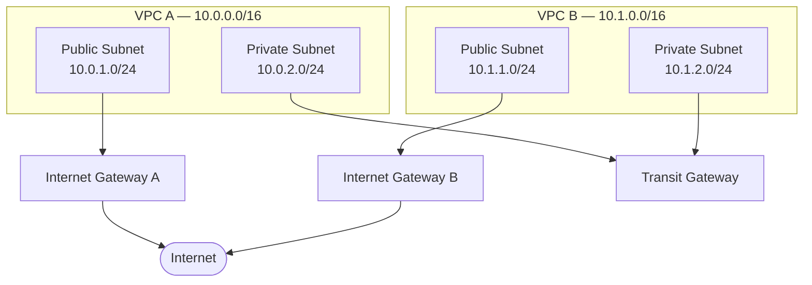

# AWS Network Lab — Terraform + HCP Terraform

Two-VPC network built with Terraform, provisioned through HCP Terraform's VCS-driven workflow (GitHub-triggered plan/apply, no local Terraform CLI required). Includes a Python/boto3 script that independently inventories the live AWS environment and cross-checks it against what the code declares.

## Architecture

Each VPC has a public subnet (routed to the internet via its own Internet Gateway) and a private subnet (routed to the *other* VPC via a shared Transit Gateway — no direct internet path).

## Why Transit Gateway instead of VPC Peering

Two VPCs alone could connect with plain VPC Peering — direct, cheaper, no extra hop. But peering doesn't scale: connections grow as `n(n-1)/2`, so 5 VPCs need 10 peering connections, and peering isn't transitive (A↔B and B↔C doesn't give A↔C).

Transit Gateway trades that away for a hub-and-spoke model: each VPC attaches once, and the TGW routes between everyone. Adding a third VPC later means one new attachment, not a fresh mesh. For 2 VPCs, TGW is genuinely more setup than the problem requires — the choice here was made deliberately to practice the pattern that scales, not because 2 VPCs needed it.

## What's built

- 2 VPCs, each with a public + private subnet, an Internet Gateway, and dedicated route tables (not the default main table)
- 1 Transit Gateway with VPC attachments in each VPC's private subnet, plus explicit cross-VPC routes
- Infrastructure fully defined in Terraform, applied through HCP Terraform's VCS-driven workflow — every change is a GitHub commit, every run is reviewable before apply
- `network_inventory.py` — a boto3 script that independently queries live AWS state (VPCs, subnets, route tables), exports it to JSON, and flags any route in a `blackhole` state

## Deployment flow

1. Edit `.tf` files directly on GitHub (or via a feature branch + PR for reviewed changes)
2. A commit to `main` triggers an automatic plan run in HCP Terraform — no local Terraform CLI required
3. Review the plan output in the HCP Terraform UI (resource counts, any unexpected `-/+` replacements)
4. Confirm & apply — HCP Terraform provisions against AWS using workspace-scoped credentials
5. Verify independently with `automation/network_inventory.py`, which queries AWS directly and cross-checks against what the code declares

## Cleanup

To tear down everything this project manages:

1. HCP Terraform workspace → **Settings → Destruction and Deletion → Queue destroy plan**
2. Review the destroy plan (resource count should match what's currently in state)
3. Confirm & apply
4. Re-run `automation/network_inventory.py` — it should return an empty VPC list, confirming a clean teardown

Note: Transit Gateway and its VPC attachments can take several minutes to fully delete due to AWS-side ENI detachment — this is expected, not a stuck run.

## Repo structure

| File | Purpose |
|---|---|
| `versions.tf` | Terraform version + HCP Terraform backend config |
| `providers.tf` | AWS provider configuration |
| `main.tf` | VPCs, subnets, IGWs, route tables |
| `transit_gateway.tf` | Transit Gateway, attachments, cross-VPC routes |
| `variables.tf` | CIDR blocks, naming, AZ inputs |
| `outputs.tf` | Resource IDs for verification and future use |
| `automation/network_inventory.py` | Independent AWS state inventory, JSON/CSV export, blackhole route detection |

## Notes from building this

- Terraform's dependency graph is inferred from references (`aws_vpc.main.id`), not declared manually — but `depends_on` is still needed when a dependency isn't visible through a direct attribute reference (the TGW routes depend on both attachments existing, but only reference the TGW itself).
- Renaming a resource in code (e.g. `aws_vpc.main` → `aws_vpc.this["vpc_a"]` during a refactor to `for_each`) is treated by Terraform as delete-and-recreate, not a rename — worth planning around before running it against anything with real dependents.
- Least-privilege IAM scoping surfaced real friction: EC2 networking actions needed granting incrementally, a first-ever Transit Gateway attachment in the account required a one-time `iam:CreateServiceLinkedRole` permission that isn't obvious from the EC2-side error message, and IAM's inline-policy size limit (2,048 characters, shared across all inline policies on one user) forced a move to a standalone customer-managed policy (6,144-character limit) instead.
