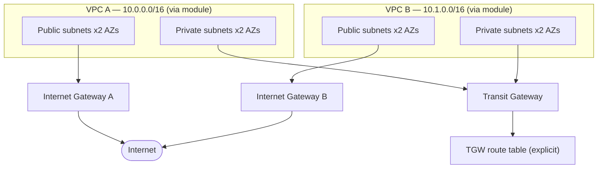

# AWS Network Lab — Terraform + HCP Terraform

Two-VPC network built with Terraform, provisioned through HCP Terraform's VCS-driven workflow (GitHub-triggered plan/apply, no local Terraform CLI required). Includes a Python/boto3 script that independently inventories the live AWS environment, cross-checks it against what the code declares, and verifies Transit Gateway routing integrity.

## Tech stack

- **Terraform** — infrastructure as code, modules, remote state
- **HCP Terraform** — VCS-driven plan/apply, no local CLI required
- **AWS** — VPC, Transit Gateway, Internet Gateway, Route Tables, IAM
- **Python + boto3** — independent AWS state auditing and reporting
- **Git / GitHub** — branch + pull request workflow, code review before merge

## Architecture

Each VPC is built from a single reusable `modules/vpc` module (name/CIDR/subnet inputs), spans two Availability Zones for redundancy, and has a public subnet (routed to the internet via its own IGW) and a private subnet (routed to the *other* VPC via a shared Transit Gateway).

## Why Transit Gateway instead of VPC Peering

Two VPCs alone could connect with plain VPC Peering — direct, cheaper, no extra hop. But peering doesn't scale: connections grow as `n(n-1)/2`, so 5 VPCs need 10 peering connections, and peering isn't transitive (A↔B and B↔C doesn't give A↔C).

Transit Gateway trades that away for a hub-and-spoke model: each VPC attaches once, and the TGW routes between everyone. Adding a third VPC later means one new attachment, not a fresh mesh. For 2 VPCs, TGW is genuinely more setup than the problem requires — the choice here was made deliberately to practice the pattern that scales, not because 2 VPCs needed it.

## Why an explicit TGW route table instead of the default

By default, every TGW attachment auto-associates and auto-propagates into AWS's built-in default route table. That works, but it's implicit — you can't selectively control which attachments can reach which others without managing route tables directly. This project disables default association/propagation and manages a route table explicitly, with separate `aws_ec2_transit_gateway_route_table_association` and `aws_ec2_transit_gateway_route_table_propagation` resources per attachment. Association controls which table an attachment's traffic is evaluated against (one at a time); propagation controls whether that attachment's routes are advertised into a table (many at a time) — managing both explicitly is what makes future traffic segmentation (e.g., isolating an untrusted VPC) possible without restructuring.

## What's built

- 2 VPCs, each built from a shared `modules/vpc` Terraform module, with public + private subnets across 2 Availability Zones, an Internet Gateway, and dedicated route tables (not the default main table)
- 1 Transit Gateway with redundant multi-AZ VPC attachments, plus an explicit TGW route table with per-attachment association and propagation
- Infrastructure fully defined in Terraform, applied through HCP Terraform's VCS-driven workflow — every change is a GitHub commit reviewed via pull request before merge
- `automation/network_inventory.py` — a boto3 script that independently queries live AWS state (VPCs, subnets, route tables, TGW attachments), exports to JSON/CSV, flags blackhole routes, and flags any TGW attachment that's associated but not propagating

## Example output

Terminal output from a real run against the live environment:

\`\`\`
TGW Attachments:
  tgw-attach-097ced1cd8c4eb1d1 -> vpc-0b327387db9b47875 [available]
  tgw-attach-0ef21bb17b1e767f0 -> vpc-07c6aed5491633a67 [available]

TGW route table OK: every associated attachment is propagating.
\`\`\`

A trimmed excerpt of `network_inventory.json`:

\`\`\`json
{
  "vpc_id": "vpc-0b327387db9b47875",
  "subnets": [
    { "subnet_id": "subnet-0fcfdf59828e0d522", "cidr": "10.0.1.0/24" }
  ],
  "routes": [
    { "route_table_id": "rtb-0c30a0d62ed9f196f", "destination": "10.1.0.0/16", "target": "tgw-0715372b9e7a72896", "state": "active" }
  ]
}
\`\`\`

## Deployment flow

1. Edit `.tf` files via a feature branch and pull request
2. HCP Terraform's speculative plan runs automatically on the PR, showing the diff before merge
3. Review the plan (resource counts, any unexpected `-/+` replacements)
4. Merge the PR — this triggers the real run against `main`
5. Manually confirm & apply in HCP Terraform (auto-apply is intentionally off)
6. Verify independently with `automation/network_inventory.py`

## Verification steps

- AWS Console → VPC → confirm 2 VPCs, 4 subnets each across 2 AZs
- AWS Console → Transit Gateway Route Tables → confirm both attachments associated, both CIDRs propagated, both routes present
- Run `automation/network_inventory.py` — confirm no blackhole routes and no propagation gaps reported

## Cleanup

1. HCP Terraform workspace → **Settings → Destruction and Deletion → Queue destroy plan**
2. Review the destroy plan (resource count should match current state)
3. Confirm & apply
4. Re-run `automation/network_inventory.py` — should return an empty VPC list

Note: Transit Gateway and its attachments can take several minutes to fully delete due to AWS-side ENI detachment — this is expected, not a stuck run.

## Failure scenarios tested

**Scenario: silent propagation gap.** Removed the `aws_ec2_transit_gateway_route_table_propagation` resource for one VPC's attachment while leaving its association intact — a realistic mistake, since association and propagation are separate controls and dropping one doesn't error loudly.

**Effect:** the affected VPC's private route table lost its route to the other VPC's CIDR (visible in the TGW route table's Routes tab — one entry instead of two), while the *other* VPC still appeared to have a working route to it. An asymmetric, partial failure — not a clean total outage — which is exactly the kind of gap that's easy to miss without checking the right layer.

**Diagnosis:** confirmed via the AWS Console (TGW Route Tables → Routes tab showing only one CIDR) and via `automation/network_inventory.py`'s new `check_tgw_propagation_gaps()` check, which compares associated attachments against propagating attachments and flags the difference. Notably, the *original* version of the script (VPC-side route inspection only) had no visibility into this at all — it reported everything as healthy, because the break happened at a layer the script didn't inspect yet. That gap is what motivated adding the TGW-side checks.

**Fix:** restored the propagation resource, applied, and confirmed both the console Routes tab and the script's automated check reported the route and the propagation as present again.

## What I would change for production

- **Multi-account design** — this lab runs everything in one AWS account. In production, workload VPCs would live in separate accounts (via AWS Organizations), with the Transit Gateway centralized in a shared networking account and attachments shared across accounts via AWS RAM.
- **Centralized inspection** — traffic currently flows VPC-to-VPC directly through the TGW. A production design would route inter-VPC traffic through a dedicated inspection VPC with a firewall appliance (e.g., AWS Network Firewall or a Palo Alto VM-Series instance) for centralized policy enforcement and logging.
- **High availability** — subnets are already spread across 2 AZs, but there's no multi-region redundancy. A production design serving multiple regions would need inter-region TGW peering or a global network layer.
- **Logging** — VPC Flow Logs and Transit Gateway Flow Logs are not currently enabled. Production would ship both to CloudWatch Logs or S3 for traffic visibility and incident investigation.
- **Permissions** — the IAM policy used here grants broad EC2 networking actions with `Resource: "*"`, which is largely unavoidable since most EC2 networking actions don't support resource-level ARN restrictions. A production setup would still separate read-only/audit roles from write/apply roles, and scope the apply role to only the CI/CD system, not an individual engineer's local credentials.
- **CI/CD approval controls** — applies here are confirmed manually by one person in the HCP Terraform UI. Production would require mandatory PR review from a second engineer, and likely a policy-as-code gate (Sentinel or OPA) checking things like "no `0.0.0.0/0` ingress" before any apply is allowed to proceed.

## Repo structure

| File | Purpose |
|---|---|
| `versions.tf` | Terraform version + HCP Terraform backend config |
| `providers.tf` | AWS provider configuration |
| `network.tf` | Root-level module calls for VPC A and VPC B |
| `modules/vpc/main.tf` | Reusable VPC module — VPC, subnets, IGW, route tables |
| `modules/vpc/variables.tf` | Module inputs — name, CIDR, subnet lists |
| `modules/vpc/outputs.tf` | Module outputs — VPC ID, subnet IDs, route table IDs |
| `transit_gateway.tf` | Transit Gateway, attachments, explicit route table, association/propagation, cross-VPC routes |
| `variables.tf` | Root-level CIDR blocks, naming, AZ inputs |
| `outputs.tf` | Resource IDs for verification and downstream use |
| `automation/network_inventory.py` | Independent AWS state inventory, JSON/CSV export, blackhole + propagation-gap detection |

## Notes from building this

- Terraform's dependency graph is inferred from references (`aws_vpc.this.id`), not declared manually — but `depends_on` is still needed when a dependency isn't visible through a direct attribute reference (the TGW routes depend on both attachments existing, but only reference the TGW itself).
- Moving resources into a module changes their address (`aws_vpc.this["vpc_a"]` → `module.vpc_a.aws_vpc.this`), which Terraform treats as delete-and-recreate, not an in-place refactor — a full destroy/rebuild is expected the first time resources move into a module.
- `default_route_table_association = "disable"` on the TGW only affects attachments created *after* the change — pre-existing attachments stay associated with the old default table until manually disassociated, since Terraform never tracked that original auto-association in the first place.
- Least-privilege IAM scoping surfaced real friction: EC2 networking actions needed granting incrementally, a first-ever Transit Gateway attachment in the account required a one-time `iam:CreateServiceLinkedRole` permission, and IAM's inline-policy size limit forced a move to a standalone customer-managed policy.